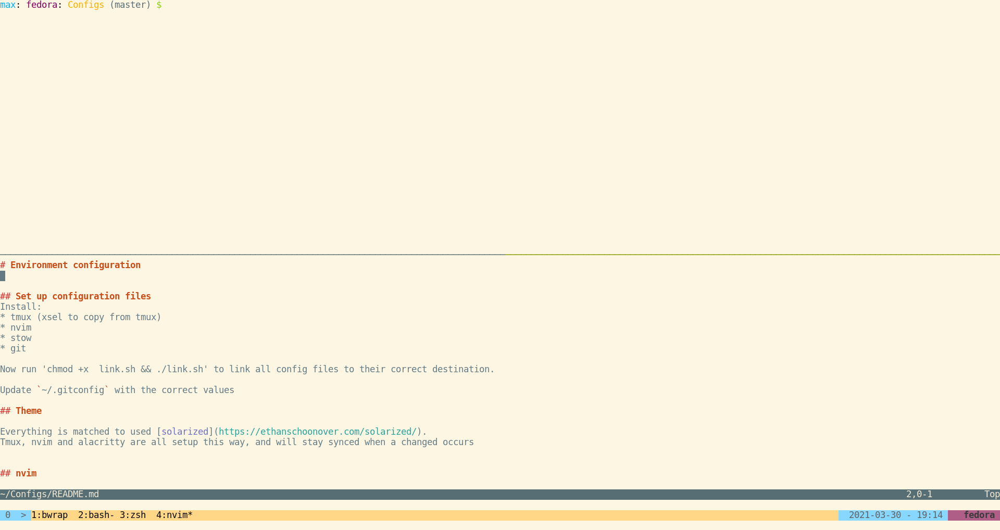

# Environment configuration

## Set up configuration files
Install:
* tmux (xsel to copy from tmux)
* nvim
* stow
* git

Now run 'chmod +x  link.sh && ./link.sh' to link all config files to their correct destination.

Update `~/.gitconfig` with the correct values

## Theme

Everything is matched to used [solarized](https://ethanschoonover.com/solarized/).
Tmux, nvim and alacritty are all setup this way, and will stay synced when a changed occurs

## tmux

### Shortcuts
**Leader is** `Ctrl+a`
**Meta key depends on your OS**

- Reload tmux config on the fly: \<Leader\> + Shift + R
- Split window vertically: Meta+\
- Split window horizontally: Meta+-
- Move to window down: Meta+j
- Move to window up: Meta+k
- Move to window right: Meta+l
- Move to window left: Meta+h
- Increase window size to the top: Meta+Shift+k
- Increase window size to the bottom: Meta+Shift+j
- Increase window size to the right: Meta+Shift+l
- Increase window size to the left: Meta+Shift+h
- New window: Meta+c
- Kill window: \<Leader\> + Shift + q

- Enter copy mode: \<Leader\> + ]
- Select in copy mode: v
- Copy in copy mode: y
- Toggle rectangle select in copy mode: r

## nvim

First make sure to install [vim-plug](https://github.com/junegunn/vim-plug) for nvim.

Then start nvim and run `:PlugInstall`

### Shortcuts

**Leader key is** `,`

- Vertical Split: \<Leader\> + \
- Horiztontal Split: \<Leader\> + -
- Move to window above: \<Leader\> + k
- Move to window below: \<Leader\> + j
- Move to window right: \<Leader\> + l
- Move to window left: \<Leader\> + h
- Remove search highlights: \<Leader\> + <space>

